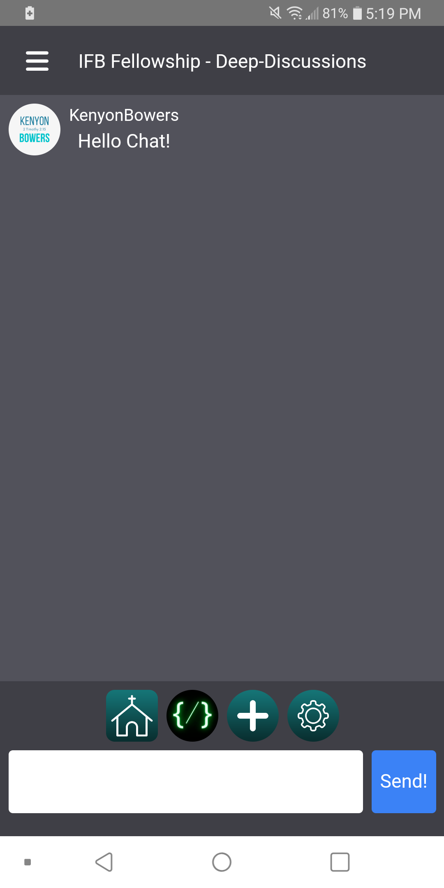
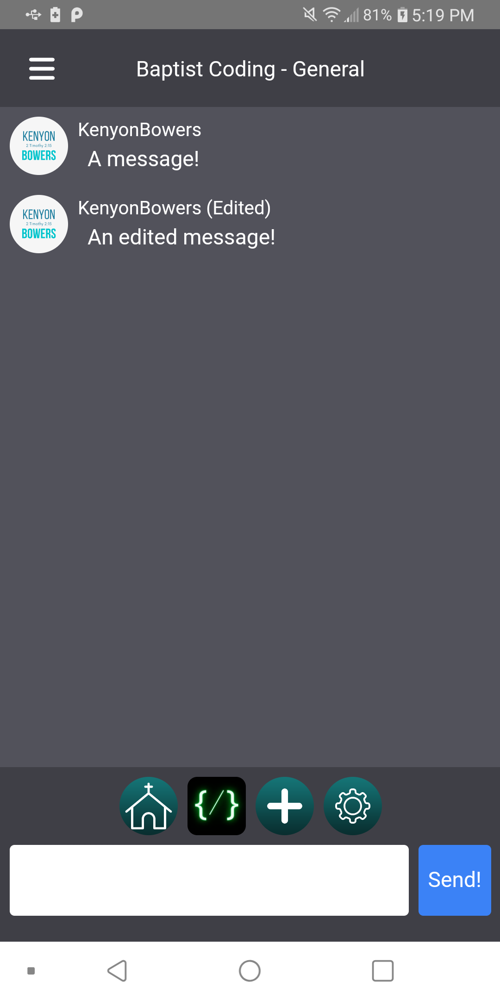

    
    <h1>Shield</h1>

## What is it?
Shield is a real-time chat app designed to give Independent Fundamental Baptists a place they can speak openly about Jesus without the worry of being canceled by big corporations.

## Is your privacy safe?
I feel it is important in our modern world to make sure people know what you will do with information about them. And Shield is no exception. Shield does not collect information about you. The most information we will collect is if <b>you</b>, the user, send messages with <b>your</b> personal information. This information is stored in the database with the rest of the messages. We don't seek to use your information or sell it.

## Why use Shield compared to other chat apps like Discord, Messenger, etc?
Other than Shield being directed towards Independent Fundamental Baptists, there isn't much that makes it stand out. I don't like to say that but it is true. In it's current state, it has only the features an average chat app has.

## What Operating Systems is Shield on?
Currently there is only a Windows and Android app. You can download it on the [Itch.io page](https://kenyonbwrs.itch.io/shield).

## Screenshots and Videos:

    
    
    

## Future Features:
- Profile Customization
- Account Modification
- Notifications on New Message Sent
- Replying to Messages